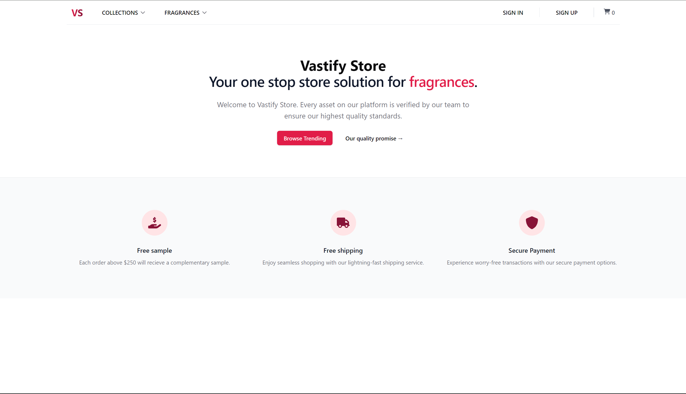

# Vastify Store

An experimental e-commerce project made for me to work with Next.js 14, Shadcn-ui, tRPC, MongoDB & PayloadCMS. This project uses Express.js to decouple the project from Vercel/Next.js environment. Once This project is done, it will replace my [Fragrance Fresh](https://fragrance-fresh.vercel.app/) project.

## Project Link: 
[Click Here!](http://vastify.vercel.app/)

## Tech Stack:
- Typescript
- Next.js 14
- Express.js
- TailwindCSS
- Shadcn-ui
- Payload CMS  
- MongoDB 
- tRPC
- cross-env

## TODOs:
- [ ] (URGENT) Fix server-side data fetching error between Express.js & Next.js 14
- [ ] Finish Navbar
- [x] ~~Add Hero section~~
- [x] ~~Add Navbar & its interactivity~~
- [x] ~~Add Shopping Cart Component~~
- [x] ~~Setup Express Server~~
- [x] ~~Setup PayloadCMS~~
- [x] ~~Setup MongoDB~~
- [x] ~~Setup Express.js server~~
- [x] ~~Connect MongoDB to PayloadCMS~~
- [x] ~~Setup Admin Panel~~
- [x] ~~Setup tRPC~~
- [x] ~~Connect tRPC to Next.js~~
- [x] ~~Create & Finish sign-up page~~
- [x] ~~Create & Handle Auth flow~~
- [x] ~~Handle email verification~~
- [x] ~~Handle error messages for auth~~
- [x] ~~Create & Finish sign-in page~~
- [x] ~~Create sign-out logic~~
- [x] ~~Create & Implement Media Collection~~
- [x] ~~Create & Implement Products Collection~~